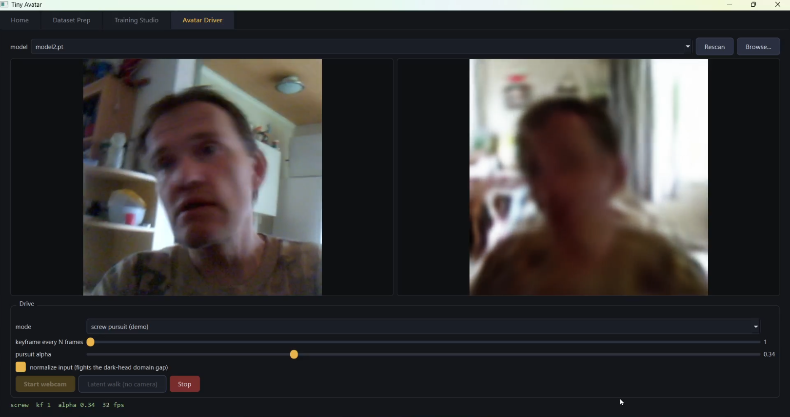
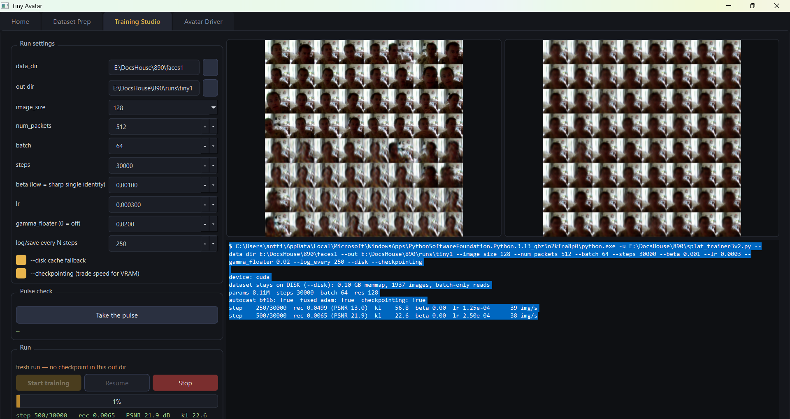
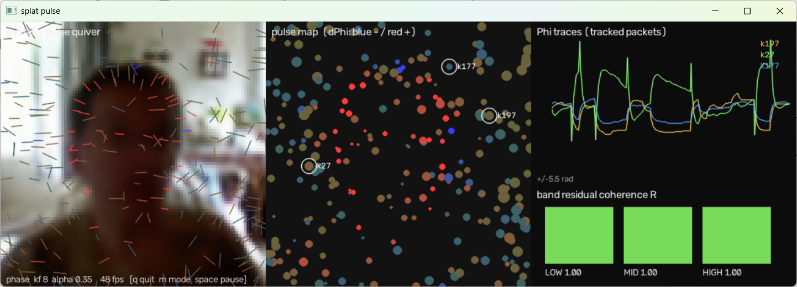

# Tiny Avatar

Video about it: https://www.youtube.com/watch?v=6TzSXNmUlxE



A tiny wave-interference face model you can train on yourself and drive
live from a webcam. The training checkpoint is ~22 MB; its exported
decoder — the generative half — is ~7 MB of ONNX. Rendered by nothing
but wave interference.

A small VAE maps a 128-dimensional latent to a few hundred **Gabor wave
packets** (position, scale, orientation, frequency, and a complex
amplitude per color channel). The image is the sum of those packets'
ripples pushed through a sigmoid. No pixel buffers, no convolutions in
the decoder — the face *is* the interference pattern.

The avatar runs on **phase-transport pursuit**: between encoder
keyframes, each packet's complex amplitude is rotated along the shortest
arc instead of crossfaded. Crossfading complex amplitudes can cancel the
wave mid-path (the image dissolves into "fire"); rotating them keeps
amplitude constant while the ripple physically glides. That is the one
idea this repo exists to demonstrate — and it has since been upgraded
from a measurement to a formula (see **Ledger**).



## What's in the repo

| File | What it is |
|---|---|
| `tiny_avatar.py` | The studio app — dataset preparation, training, and avatar driving, all in one window |
| `splat_trainer3v2.py` | The trainer (standalone CLI; the app wraps it as a subprocess) |
| `model2.pt` | A CelebA-trained checkpoint (96 px / 256 packets, ~22 MB) so you can try the avatar without training anything |

**On file formats, honestly:** the studio drives `.pt` checkpoints only
— the avatar needs the *encoder* (webcam frame → latent), and the
checkpoint carries encoder + decoder together. `--export` writes the
~7 MB `splat_decoder.onnx` (decoder only) for the standalone cv5 tool
line; the studio does not load ONNX.

## Install


```
pip install -r requirements.txt
pip install torch PyQt6 opencv-python numpy psutil
pip install pynvml        # optional: GPU % readout in the training tab
python tiny_avatar.py
```

Python 3.10+. CUDA strongly recommended for training; the avatar itself
runs even on CPU (the model is tiny).

## Try it in one minute (no training)

1. Start the app, go to **Avatar Driver**.
2. The bundled `model2.pt` is auto-detected (any `.pt` next to the app
   or under `runs/` shows up in the dropdown).
3. Click **Latent walk** — the model surfs its own face manifold using
   phase-transport pursuit. This is the "surf that never melts" demo.
4. Or click **Start webcam**. Expect this, honestly: with the CelebA
   model your reconstruction will be a **blurry dark head that tracks
   your pose**. That's a domain gap, not a bug. To get an avatar that
   actually looks like you, train on yourself:

## Train on yourself

**1 — Record.** 1–2 minutes of yourself talking, turning your head
through angles, changing expression, with a little lighting variation.
One person only. Landscape orientation is safest (the app un-rotates
phone clips from their rotation tag; if the preview still shows you
sideways, re-shoot in landscape).

**2 — Dataset Prep tab.** Point it at the video. Face-detect crop is on
by default and recommended. Watch the preview: if the crop locks onto
the wrong thing, uncheck face-detect and re-run with the center crop. A
few hundred frames minimum; ~2000 is comfortable.

**3 — Training Studio tab.** Set `data_dir`, pick an out dir, hit
**Take the pulse** (checks VRAM, engages the `--disk` memmap fallback
if the cache won't fit — that's how 128 px / 512 packets trains on a
12 GB card), then **Start training**. Hours, not minutes, at face
resolutions. Previews update every log step; checkpoints save every log
step; **Stop** and **Resume** are safe, and the preprocessing cache is
reused so restarts are instant. Leave `--checkpointing` off unless you
actually OOM — it trades speed for VRAM.

**The diversity knobs, honestly explained.** Low `beta` (0.001–0.005,
the band that works on this architecture) keeps a single identity sharp
— but at low beta a VAE's *reconstructions* stay diverse while its
*prior samples* average toward one bland face, because random z lands
off the encoder's actual latent region. Two consequences worth knowing:

- **The avatar mostly doesn't care** — it drives z from the *encoder*,
  not the prior. Bland prior samples do not mean a bland avatar.
- **The sample preview and any prior-sampling test DO care.** The
  trainer prints a `prior-sample diversity` number every log step
  (mean pairwise MSE over 32 prior samples). Reference points from real
  runs: the bundled 96 px CelebA model sits around 0.12; a 128 px run
  that averaged aggressively measured 0.009. A log line looks like:

```
  step    500/30000  rec 0.0080 (PSNR 21.0)  kl 10.1  beta 0.0001667 ...
          prior-sample diversity 0.00142  (96px CelebA model ref ~0.12)
```

  On a **single-identity dataset a low number is partly correct** — all
  prior samples *should* be the same subject. On multi-identity data
  (CelebA-style), a tiny number means averaging; if you want diverse
  prior samples, raise `beta` with `free_bits` set (0.03–0.10): the
  per-dim KL floor is the standard tool that lets beta rise without the
  collapse this architecture hits otherwise. Its effect here is
  **unmeasured until you run it** — that is what the printed number is
  for.

Augmentation (`--aug`, on by default: horizontal flip + light
brightness/contrast jitter, on-GPU, effectively free) improves pose
coverage and narrows the webcam domain gap.

## Not just faces

The subject doesn't have to be human. Any visually consistent subject
with smooth pose/expression variation trains the same way — as a smoke
test, a 10,000-frame synthetic cartoon-creature dataset (64 px,
procedurally animated) cached in seconds, sat resident on the GPU at
0.12 GB, and trained at ~560 img/s on a 12 GB RTX 3060 at 64 px / 128
packets. Small resolutions turn "hours" into "minutes" and are a good
way to learn the knobs before committing an evening to your own face.

## Avatar Driver

Select your checkpoint, **Start webcam** (or **Latent walk**).

- **mode** — `phase pursuit` (the transport mechanism), `lerp pursuit`
  (baseline, for comparison), `direct` (re-encode every frame; jittery,
  full cost), `screw pursuit` (**demo**: packet geometry follows the
  SE(2) screw geodesic — rotation about a computed center — instead of
  position-lerp + angle-arc; mathematically exact on rigid rotations in
  isolated tests, expected to matter on head turns and to change
  nothing on translation; not yet A/B-certified live).
- **keyframe every N frames** — encoder rate; everything between is
  pure transport.
- **pursuit alpha** — fractional step toward the latest keyframe per
  display frame. Higher = snappier, lower = smoother.
- **normalize input** — pushes webcam brightness/contrast toward the
  face-dataset statistics; helps the domain gap.

## Using the trainer without the GUI

```
python splat_trainer3v2.py --data_dir faces1 --out runs/me \
       --image_size 128 --num_packets 512 --beta 0.001 --disk \
       --free_bits 0 --aug 1
```

First run builds a one-time uint8 `.npy` cache. `--disk` reads batches
straight from the memmap: VRAM → RAM → disk, in order of what fits.
`--export` writes the ~7 MB `splat_decoder.onnx` (opset 17, dynamic
batch, `z_latent` → `rendered_image`) for the cv5 tools.

## Diagnostic Telemetry: `splat_pulse.py` & Geometric Signal Processing



To observe the real-time physical "pulse" of the Gabor wave medium as the avatar moves, run the standalone diagnostic instrument `splat_pulse.py`:

```bash
# Run live latent walk pulse monitoring
python splat_pulse.py --walk

# Run live webcam pulse monitoring
python splat_pulse.py --cam 0
```

> **Note:** `splat_pulse.py` imports core pursuit and framing machinery directly from `tiny_avatar3.py` (or `tiny_avatar.py`), so keep `splat_pulse.py`, `tiny_avatar.py`, and your trainer scripts in the same folder.

### What the Instrument Measures

**Avatar + Pulse Quiver (Left Panel):**  
Renders the face overlay with oriented ticks for each wave packet \(k\). The tick angle shows packet orientation \(\theta_k\), length scales with magnitude \(m_k\), and color (blue \(\leftarrow 0 \rightarrow\) red) tracks the instantaneous phase velocity \(\Delta \phi_k\). Smooth movements appear as sweeping color-wave fronts across the medium.

**Pulse Map in Coordinate Space (Center Panel):**  
Displays packet centers \(\mathbf{p}_k\) in spatial coordinates, highlighting tracked orbit packets (\(\text{k27}\), \(\text{k177}\), \(\text{k197}\)) across motion.

**\(\Phi\) Traces & Band Coherence \(R_{\text{band}}\) (Right Panel):**

**\(\Phi\) Traces:**  
Plots live, unwrapped phase trajectories over time—streaming 1D Takens delay embeddings of individual packet orbits.

**Band Residual Coherence \(R_{\text{band}}\):**  
Measures how closely actual phase velocity matches the predicted dispersion law across LOW (\(f_k < 3\)), MID (\(3 \le f_k < 8\)), and HIGH (\(f_k \ge 8\)) carrier bands:

$$
R_{\text{band}} =
\frac{\left| \sum_k m_k e^{i e_k} \right|}
{\sum_k m_k},
\qquad
e_k = \Delta \phi_k -
\left(-2\pi f_k (\mathbf{u}_k \cdot \mathbf{v}_k)\right)
$$

**In-Manifold State (\(R \rightarrow 1.0\)):**  
High-coherence state where spatial translation and carrier phase advance remain fully phase-locked.

**Decoherence / "Fire State" (\(R \rightarrow 0.0\)):**  
High-frequency detail desynchronizes first during rapid off-manifold shifts or framing breaks, scattering phases before visible reconstruction failure occurs.

### Theoretical Link: Continuous Geodesic Delay Lines

This pulse monitoring directly bridges wave-packet generative models with the continuous dynamics of Geometric Processing / Delay-Line Networks:

- Rather than evaluating static pixel matrices, the latent space maps to spatiotemporal delay channels.
- Each packet acts as a localized harmonic filter carrying complex amplitude, phase angle, and carrier frequency:
  \[
  P_k = (\mathbf{p}_k, \sigma_k, \theta_k, f_k, \mathbf{c}_k)
  \]
- Information moves through the network as continuous phase fronts along Riemannian geodesics—where phase advance (\(\Delta \phi_k\)) corresponds to physical spatial propagation across local receptive fields.


## Ledger — what is measured vs. what is a demo

This project's rule: do not hype, do not lie, just show. Registered
thresholds, then runs, then verdicts.

**Certified — the fire law** (`fire_law_screw_test.py --real`, 128 px /
512 packets, 8 pairs, thresholds registered before running):

- The crossfade's amplitude loss has a **closed form**. Per packet,
  `|psi(t)|^2 = (1-t)^2 aA^2 + t^2 aB^2 + 2 t(1-t) aA aB cos(dphi)`.
  Evaluated on **endpoint phases alone — no rendering** — it predicted
  the measured lerp/transport field ratio of 384 rendered frames to a
  mean error of 0.022, with 8/8 agreement on the fire verdicts, and
  matched the raw coefficients to 4e-16.
- Why crossfade usually looks fine: random same-model face pairs sit at
  amplitude-weighted `|dphi|` of 0.2–0.6 rad, where `cos(dphi/2)` is
  0.96–1. The catastrophic fire — the mid-morph gray-out — is the
  formula's zero at `dphi = pi`: extrapolation, phase scrambles, fast
  off-manifold moves. Transport is the scheme whose amplitude *cannot*
  dip regardless of `dphi`: the safety margin, purchased with one
  rotation matrix.
- Screw interpolation (isolated math): recovers a rigid rotation to
  1.6e-16 where decoupled lerp+arc errs at 4e-2, and is identical to
  lerp on pure translation to 1.2e-16.

**Certified — earlier gates** (`splat_avatar_gate.py`, 96 px model, 8
pairs): transport mid-path frames sharper than the decoder's own latent
road at every t, 8/8; road agreement across full identity swaps, 8/8;
scrambled phases break road agreement ~10x, 8/8 — coherent phase is the
mechanism, not a coincidence.

**Honest revision log** (kept because the misses taught more than the
hits): the original claim "lerp burns, transport doesn't" measured 4/8
on one model, then 0/8 on a second — and was then *explained*: both
runs sat in the small-`dphi` regime the closed form predicts to be
fire-free. On the second model, a gap-relative road-agreement gate also
mis-fired on tiny-gap pairs (a denominator artifact; transport's road
deviation was within 1.15x of the baseline's on all pairs). The claim
that survived is smaller and stronger than the original: **the fire is
a formula, and transport is its guarantee.**

**Demo, not certificate:** the pursuit scheme itself; screw mode as a
*live avatar* mode (awaiting the head-turn A/B); `free_bits`' diversity
effect on this architecture; the pulse check's renderer estimate is a
labeled heuristic.

**Known limitations:** the webcam encoder has a real domain gap on
out-of-distribution input (single-identity training is the fix, input
normalization the band-aid); Haar-cascade face detection is fast, dumb,
upright-only — the extraction preview exists so you catch a bad lock
before training does; and this will not out-render modern talking-head
or diffusion avatars and isn't trying to. The trade it makes: a
decoder measured in single-digit megabytes, in-between frames produced
by one rotation matrix, and every claim above backed by a CSV.

## License / provenance

Trainer, renderer math, transport tests, and app developed in an
ongoing human + AI collaboration (Anthropic's Claude models, Google
Gemini, DeepSeek, ChatGPT, others) at PerceptionLab. The bundled
checkpoint was trained on CelebA — respect the CelebA terms
(non-commercial research) for that file; your own-face models are
yours.
